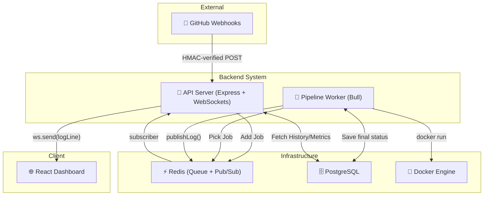

# ⚡ CI/CD Engine

A self-hosted, distributed CI/CD pipeline engine. Push to GitHub → pipeline runs inside isolated Docker containers → logs stream live to the dashboard.

> Built to demonstrate distributed systems, real-time communication, Docker-based execution, and production-grade backend architecture.

---

## 🎯 Why This Project Stands Out (For Recruiters & Engineers)

Most portfolio CI/CD projects simply call an existing cloud API (like GitHub Actions). **This project builds the pipeline engine itself from scratch.**

It solves real distributed systems challenges:
- **Non-blocking Execution:** The Express server never blocks on Docker execution.
- **Cross-process Streaming:** Log lines cross three process boundaries in real time (`Docker` → `Worker` → `Redis Pub/Sub` → `Server` → `WebSocket` → `Browser`).
- **Resiliency:** A worker crash doesn't lose a run. Stuck jobs are automatically recovered and retried via a Redis-backed queue.
- **Security layered correctly:** HMAC-SHA256 for GitHub webhooks (preventing unauthorized triggers), stateless JWTs for API access, RBAC for authorization, and timing-safe comparisons.

---

## 🚀 How to Use (Quickstart for Users)

If the system is already deployed, using it for your own GitHub repositories is incredibly easy:

### Step 1: Create an Account
1. Go to the deployed frontend URL.
2. Sign up for a new account. You will automatically receive `admin` access.

### Step 2: Add Pipeline Config to Your Repo
In the root of your GitHub repository, create a file named `.pipeline.json` (or `.pipeline.yml`):

```json
{
  "name": "My Node App Pipeline",
  "steps": [
    {
      "name": "Install Dependencies",
      "command": "npm install",
      "image": "node:20-alpine"
    },
    {
      "name": "Run Tests",
      "command": "npm test",
      "image": "node:20-alpine"
    }
  ]
}
```
Commit and push this file to your repository.

### Step 3: Configure GitHub Webhook
1. Go to your GitHub repository → **Settings** → **Webhooks** → **Add webhook**.
2. **Payload URL:** `https://<YOUR-CICD-DOMAIN>/webhook/github`
3. **Content type:** `application/json`
4. **Secret:** Provide the `GITHUB_WEBHOOK_SECRET` provided by the platform admin.
5. **Events:** Select "Just the push event".
6. Click **Add webhook**.

### Step 4: Watch It Run
Now, every time you push code to GitHub:
1. The engine automatically clones your repository.
2. It parses your `.pipeline.json`.
3. It spins up a clean Docker container (`node:20-alpine`) for each step.
4. You can open the **CI/CD Engine Dashboard** and watch the logs stream in real time!

---

## 🛠️ Tech Stack & Architecture

| Technology | Why it was chosen |
|---|---|
| **Node.js + Express** | Non-blocking I/O suits the server's need to handle webhooks, API requests, and WebSocket connections concurrently. |
| **Redis + Bull** | Job queue handling persistence, retries, backoff, and concurrency control out of the box. |
| **ioredis (Pub/Sub)** | Dedicated connections for real-time, cross-process log streaming. |
| **PostgreSQL (pg)** | Relational model perfectly fits the `pipelines` → `runs` → `steps` → `logs` hierarchy. |
| **Docker** | Each pipeline step runs inside an isolated, ephemeral container (`docker run --rm`), ensuring reproducible builds without polluting the host. |
| **WebSockets (ws)** | Native WS server for low-latency log streaming to the React dashboard. |
| **React + TailwindCSS** | Clean, dark-mode, responsive user interface for monitoring runs and metrics. |

### System Architecture Flow



---

## 🏗️ Pipeline Features

- **Docker-Isolated Execution:** Each step runs in its own ephemeral container (`--rm`).
- **Per-Step Docker Images:** You can specify different images per step (e.g., `node:20-alpine`, `python:3.11-alpine`).
- **Parallel Step Execution:** Steps in a `parallel` group run concurrently to speed up builds.
- **Live Log Streaming:** Real-time logs streamed via WebSocket, backed by Redis Pub/Sub.
- **Metrics Dashboard:** Visualize runs per day, duration trends, success rates, and top pipelines.
- **Manual Triggers:** Admins can manually trigger pipelines directly from the dashboard.

---

## 💻 Local Installation (For Developers)

Want to run the CI/CD Engine on your own machine?

### Prerequisites
- Docker + Docker Compose
- Node.js 18+

### Setup Steps
```bash
# 1. Clone the repository
git clone https://github.com/vshawale907/cicd-engine.git
cd cicd-engine

# 2. Setup Environment Variables
cp .env.example .env.development
# Edit .env.development and fill in: JWT_SECRET, GITHUB_WEBHOOK_SECRET, FRONTEND_URL

# 3. Start Infrastructure (Postgres + Redis)
docker-compose up -d

# 4. Migrate Database & Create Admin
npm run migrate
ADMIN_EMAIL=admin@example.com ADMIN_PASSWORD=admin npm run seed:admin

# 5. Start Backend Server (API + WebSockets)
npm run dev

# 6. Start Worker Engine (Job processing + Docker execution)
# Run this in a separate terminal window
npm run dev:worker

# 7. Start Frontend Dashboard
# Run this in a third terminal window
cd frontend && npm install && npm run dev
```

Navigate to `http://localhost:5173` to log in and start using your local CI/CD Engine!

---

## 🛡️ Security Implementation
- **Passwords:** Hashed via native `bcrypt` (C++ bindings).
- **Webhooks:** Validated via HMAC-SHA256 with `crypto.timingSafeEqual` (timing-attack safe).
- **Session Auth:** Stateless JWTs (JSON Web Tokens) with a 7-day expiry. Stored entirely in React state (no local storage exposure).
- **Isolation:** Pipeline steps run in strictly isolated Docker containers.

---

## 📄 License
MIT License